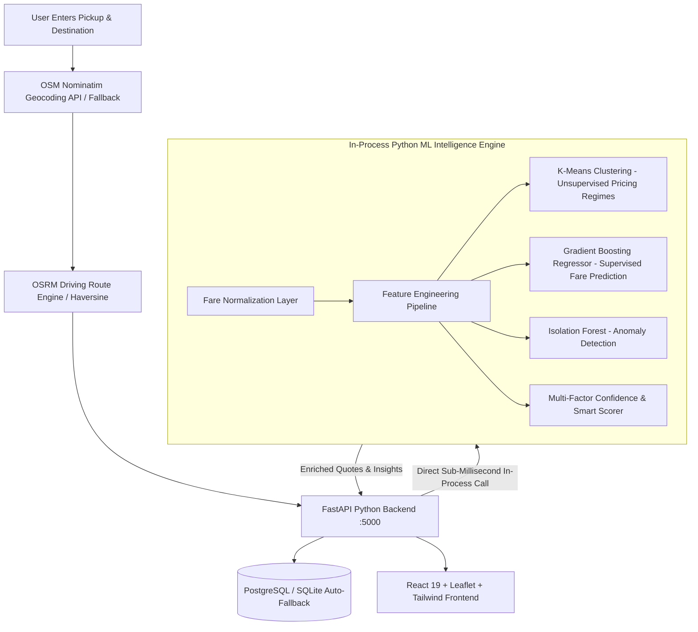

# Smart Taxi Fare Comparison — Python Backend & ML/AI Intelligence Platform 🚖🧠

RideCompare is a production-ready, intelligent real-time taxi fare comparison and fare intelligence platform built on a **100% Python Backend (FastAPI + SQLAlchemy + Scikit-Learn)** and a modern **React + Leaflet frontend**.

It aggregates provider fare estimates (Uber, Ola, Rapido, Local Taxi), computes realistic road routes using OpenStreetMap Nominatim and OSRM with Haversine fallback, and enriches every query with **unsupervised pricing regime clustering (K-Means)**, **supervised regression predictions (Gradient Boosting)**, **multivariate anomaly detection (Isolation Forest)**, and **transparent multi-factor confidence & smart ranking**.

---

## 🏛 System Architecture



---

## 🧠 Machine Learning Architecture & Academic Foundations

The platform clearly distinguishes between three complementary machine learning paradigms:

### 1. Unsupervised Learning: K-Means Clustering
* **Purpose:** Discovers underlying pricing patterns and transit conditions without labeled ground truth.
* **Input Features:** `distance_km`, `duration_min`, `actual_fare`, `fare_per_km`, `fare_per_min`, `surge_multiplier`, `traffic_level`.
* **Model Selection:** Optimal $K$ ($K=3$) is selected dynamically by evaluating **Silhouette Scores** across candidate $K \in [3, 6]$ (Silhouette $= 0.3323$).
* **Discovered Pricing Regimes:**
  - `Economy / Short Trip`: High-efficiency trips under standard non-surge conditions.
  - `Standard City Transit`: Typical urban transit rates with standard traffic and base pricing.
  - `Peak Hour Surge / Long Distance`: High surge multiplier driven by peak hours or extended highway distances.
* **Important:** K-Means is used strictly for **pattern discovery and regime labeling**, not for predicting numerical taxi fares.

### 2. Supervised Learning: Gradient Boosting Fare Regression
* **Purpose:** Estimates the theoretical expected fare (`predicted_fare`) based on route parameters and historical pricing patterns.
* **Model Comparison:** Evaluated **Gradient Boosting Regressor** against **Random Forest Regressor** on a holdout test split (80/20):
  - **Gradient Boosting Regressor (Selected):** $R^2 = 0.9803$, $\text{MAE} = ₹20.67$, $\text{RMSE} = ₹34.30$, $\text{MAPE} = 5.96\%$.
  - **Random Forest Regressor:** $R^2 = 0.9702$, $\text{MAE} = ₹23.51$, $\text{RMSE} = ₹42.21$, $\text{MAPE} = 6.41\%$.
* **Data Integrity:** The ML estimated fare is always explicitly labeled as **"ML Estimated Fare"** and never replaces the provider's **"Actual Fare"**.

### 3. Anomaly Detection: Isolation Forest
* **Purpose:** Flags unusually expensive or cheap quotes (e.g. extreme surge spikes or glitch pricing) using multivariate isolation trees and residual bounds.
* **Contamination Rate:** $3.0\%$.
* **Output:** `is_anomaly: boolean`, anomaly score, and human-readable explanation (e.g., *"Unusually high fare (+75% vs ML estimated baseline). Possible acute surge or high congestion."*).

### 4. Confidence Scoring & Multi-Factor Smart Ranking
* **Confidence Factors:** Route distance support in training distribution, model validation $R^2$, OSRM routing precision, and prediction residual divergence. Output rated as `High`, `Medium`, `Low` with percentage confidence (e.g., `94%`).
* **Transparent Ranking Formula:**
  $$\text{Smart Score} = (40\% \times \text{Price Score}) + (30\% \times \text{ETA Score}) + (15\% \times \text{Confidence Score}) + (15\% \times \text{Reliability Score})$$

---

## 🛠 Technology Stack

- **Backend:** Python 3.11, FastAPI, Uvicorn, SQLAlchemy, Pydantic v2, HTTPX.
- **Machine Learning Subsystem:** Scikit-Learn, Pandas, NumPy, Joblib (integrated in-process with sub-millisecond execution).
- **Database:** PostgreSQL with automatic SQLite fallback (`ridecompare.db`).
- **Frontend:** React 19, TypeScript, Tailwind CSS, Vite, Leaflet Maps, Lucide Icons.
- **Routing & Geocoding:** OpenStreetMap (Nominatim), OSRM Routing Engine with Haversine fallback.
- **Security:** Strict security headers (`X-Content-Type-Options: nosniff`, `X-Frame-Options: SAMEORIGIN`), CORS origin validation, non-vulnerable open window rel handlers (`noopener,noreferrer`).
- **Containerization:** Docker, Docker Compose.

---

## 🚀 Running the Application

### Method 1: Automated Local Startup (Recommended)

Run one of the startup scripts from the project root:

- **Windows Command Prompt:**
  ```cmd
  run-local.bat
  ```
- **Windows PowerShell:**
  ```powershell
  .\run-local.ps1
  ```
- **Linux / macOS:**
  ```bash
  chmod +x run-local.sh
  ./run-local.sh
  ```

---

### Method 2: Manual Step-by-Step

#### 1. Install Dependencies & Retrain ML Models (if needed)
```bash
pip install -r requirements.txt
python -m ml.training.train_pipeline
```

#### 2. Start the FastAPI Python Backend (Port 5000)
```bash
uvicorn backend.app.main:app --host 0.0.0.0 --port 5000 --reload
```

#### 3. Start the Vite React Frontend (Port 5173)
```bash
cd frontend
npm install
npm run dev
```

Open [http://localhost:5173](http://localhost:5173) in your browser.

---

### Method 3: Docker Compose

```bash
docker-compose up --build
```
- **Frontend:** [http://localhost:8080](http://localhost:8080)
- **FastAPI Backend:** [http://localhost:5000](http://localhost:5000)
- **FastAPI Interactive Docs:** [http://localhost:5000/docs](http://localhost:5000/docs)

---

## 📡 API Reference

| Method | Endpoint | Description |
|---|---|---|
| `GET` | `/api/geocode?q=...` | Proxies Nominatim geocoding with caching and offline landmark fallbacks |
| `GET` / `POST` | `/api/route` | Calculates OSRM route & returns quotes enriched with ML predictions and anomalies |
| `POST` | `/api/fare/compare` | Direct multi-provider fare comparison for given coordinates |
| `POST` | `/api/fare/predict` | Predicts expected fare for arbitrary vehicle/traffic parameters |
| `GET` | `/api/fare/history` | Fetches logged historical trip records from database |
| `GET` | `/api/ml/clusters` | Returns K-Means cluster profiles, centroids, and descriptions |
| `GET` | `/api/ml/model-performance` | Returns MAE, RMSE, MAPE, $R^2$, and Silhouette evaluation metrics |
| `POST` | `/api/ml/retrain` | Triggers background model retraining and hot-reloads models |
| `GET` | `/api/analytics` | Aggregated user search and booking redirect statistics |
| `POST` | `/api/redirect` | Tracks booking clicks and provider conversions |
| `GET` | `/health` | Server uptime, database connectivity, and ML engine status |

---

## 🧪 Automated Testing

Run the full Python test suite with pytest:

```bash
python -m pytest backend/tests/test_backend_api.py ml/tests/test_ml_pipeline.py -v
```

All 16 tests verify:
- Security headers and `/health` system checks.
- Geocoding and route calculation with ML enrichment.
- Gradient Boosting supervised regression and Isolation Forest anomaly detection.
- Unsupervised K-Means clustering and pricing regime discovery.
- Database persistence and analytics aggregation.
