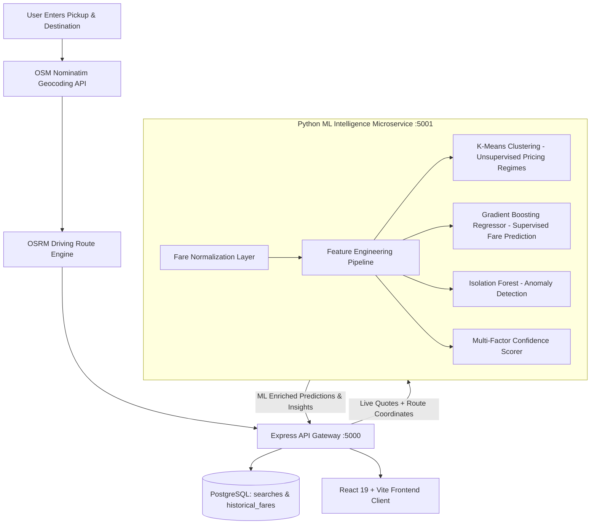

# Smart Taxi Fare Comparison — ML/AI Intelligence Platform 🚖🧠

RideCompare is a production-grade, intelligent real-time taxi fare comparison and fare analysis platform. It aggregates live provider quotes (Uber, Ola, Rapido, Local Taxi), calculates road routes with OpenStreetMap and OSRM, and enriches every comparison with machine-learning pricing intelligence, unsupervised pricing regime clustering, supervised fare regression, Isolation Forest anomaly detection, and transparent multi-factor ranking.

---

## 🏛 System Architecture



---

## 🧠 Machine Learning Architecture & Academic Foundations

The platform clearly distinguishes between three complementary machine learning paradigms:

### 1. Unsupervised Learning: K-Means Clustering
* **Purpose:** Discovers underlying pricing patterns and transit conditions without labeled ground truth.
* **Input Features:** `distance_km`, `duration_min`, `actual_fare`, `fare_per_km`, `fare_per_min`, `surge_multiplier`, `traffic_level`.
* **Model Selection:** Optimal $K$ ($K=3$) is selected dynamically by evaluating **Silhouette Scores** across candidate $K \in [3, 6]$ (Silhouette $= 0.3323$).
* **Discovered Pricing Regimes:**
  - `Economy / Short Trip`: High-efficiency trips under standard non-surge conditions.
  - `Standard City Transit`: Typical urban transit rates with standard traffic and base pricing.
  - `Peak Hour Surge / Long Distance`: High surge multiplier driven by peak hours or extended highway distances.
* **Important:** K-Means is used strictly for **pattern discovery and regime labeling**, not for predicting numerical taxi fares.

### 2. Supervised Learning: Supervised Fare Regression
* **Purpose:** Estimates the theoretical expected fare (`predicted_fare`) based on route parameters and historical pricing patterns.
* **Model Comparison:** Evaluated **Gradient Boosting Regressor** against **Random Forest Regressor** on a holdout test split (80/20):
  - **Gradient Boosting Regressor (Selected):** $R^2 = 0.9803$, $\text{MAE} = ₹20.67$, $\text{RMSE} = ₹34.30$, $\text{MAPE} = 5.96\%$.
  - **Random Forest Regressor:** $R^2 = 0.9702$, $\text{MAE} = ₹23.51$, $\text{RMSE} = ₹42.21$, $\text{MAPE} = 6.41\%$.
* **Data Integrity:** The ML estimated fare is always explicitly labeled as **"ML Estimated Fare"** and never replaces the provider's **"Actual Fare"**.

### 3. Anomaly Detection: Isolation Forest
* **Purpose:** Flags unusually expensive or cheap quotes (e.g. extreme surge spikes or glitch pricing) using multivariate isolation trees and residual bounds.
* **Contamination Rate:** $3.0\%$.
* **Output:** `is_anomaly: boolean`, anomaly score, and human-readable explanation (e.g., *"Unusually high fare (+75% vs ML estimated baseline). Possible acute surge or high congestion."*).

### 4. Confidence Scoring & Multi-Factor Smart Ranking
* **Confidence Factors:** Route distance support in training distribution, model validation $R^2$, OSRM routing precision, and prediction residual divergence. Output rated as `High`, `Medium`, `Low` with percentage confidence (e.g., `94%`).
* **Transparent Ranking Formula:**
  $$\text{Smart Score} = (40\% \times \text{Price Score}) + (30\% \times \text{ETA Score}) + (15\% \times \text{Confidence Score}) + (15\% \times \text{Reliability Score})$$

---

## 🛠 Technology Stack

- **Frontend:** React 19, TypeScript, Tailwind CSS v4, Vite, Leaflet Maps, Lucide Icons.
- **Backend:** Node.js, Express.js, TypeScript, PostgreSQL Connection Pool (`pg`), Rate Limiter, CORS.
- **Machine Learning Subsystem:** Python 3.11, FastAPI, Uvicorn, Scikit-Learn, Pandas, NumPy, Joblib.
- **Routing & Geocoding:** OpenStreetMap (Nominatim), OSRM Routing Engine.
- **Containerization:** Docker, Docker Compose.

---

## 🚀 Running the Application

### Method 1: Local Development (Recommended)

#### 1. Train the ML Models & Start ML Microservice
```powershell
# Run the training pipeline (generates models in ml/models/saved/)
python -m ml.training.train_pipeline

# Launch the FastAPI ML microservice on port 5001
python ml/server.py
```

#### 2. Start the Backend API (Port 5000)
```powershell
cd backend
npm install
npm run db:setup
npm run dev
```

#### 3. Start the Frontend App (Port 5173 / 8080)
```powershell
cd ../frontend
npm install
npm run dev
```

Alternatively, run the automated startup script:
- **Windows Batch:** `run-local.bat`
- **PowerShell:** `run-local.ps1`
- **Linux/macOS:** `run-local.sh`

---

### Method 2: Docker Compose (All-in-One Containerization)

```bash
docker-compose up --build
```
- **Frontend:** [http://localhost:8080](http://localhost:8080)
- **Backend API:** [http://localhost:5000](http://localhost:5000)
- **ML Engine:** [http://localhost:5001](http://localhost:5001)
- **PostgreSQL Database:** Port `5432`

---

## 📡 API Reference

| Method | Endpoint | Description |
|---|---|---|
| `GET` | `/api/route` | Calculates OSRM route & returns comparison enriched with ML predictions and anomalies |
| `GET` | `/api/fare/compare` | Direct fare comparison for given distance and duration |
| `POST` | `/api/fare/predict` | Predicts expected fare for custom ride parameters |
| `GET` | `/api/fare/history` | Fetches recent historical trip records from database |
| `GET` | `/api/ml/clusters` | Returns K-Means cluster profiles, centroids, and descriptions |
| `GET` | `/api/ml/model-performance` | Returns MAE, RMSE, MAPE, $R^2$, and Silhouette evaluation metrics |
| `POST` | `/api/ml/retrain` | Triggers background model retraining and hot-reloads models |
| `GET` | `/api/analytics` | Aggregated user search and booking redirect statistics |
| `GET` | `/health` | Server uptime and health status |

---

## 🧪 Automated Testing

### Python ML Test Suite
```powershell
python -m unittest ml/tests/test_ml_pipeline.py -v
```
Tests:
- Fare normalization & rate calculations.
- Feature engineering pipeline.
- Supervised regression prediction accuracy.
- Isolation Forest anomaly detection on normal vs outlier spikes.
- Multi-factor confidence scoring.
- Edge cases (short trips, extreme trips, missing parameters).

### Backend Integration Tests
```powershell
npx --prefix backend ts-node src/__tests__/run_tests.ts
```

---

## 📊 Database Schema (`historical_fares`)

```sql
CREATE TABLE IF NOT EXISTS historical_fares (
    id SERIAL PRIMARY KEY,
    provider VARCHAR(50) NOT NULL,
    vehicle_type VARCHAR(30) NOT NULL,
    source TEXT NOT NULL,
    destination TEXT NOT NULL,
    source_lat DOUBLE PRECISION,
    source_lng DOUBLE PRECISION,
    dest_lat DOUBLE PRECISION,
    dest_lng DOUBLE PRECISION,
    distance_km DOUBLE PRECISION NOT NULL,
    duration_min DOUBLE PRECISION NOT NULL,
    actual_fare DOUBLE PRECISION NOT NULL,
    base_fare DOUBLE PRECISION DEFAULT 0.0,
    surge_multiplier DOUBLE PRECISION DEFAULT 1.0,
    platform_fee DOUBLE PRECISION DEFAULT 0.0,
    toll_fee DOUBLE PRECISION DEFAULT 0.0,
    traffic_condition VARCHAR(30) DEFAULT 'Normal',
    weather_condition VARCHAR(30) DEFAULT 'Clear',
    time_of_day VARCHAR(30) DEFAULT 'Regular',
    day_of_week VARCHAR(20) DEFAULT 'Monday',
    fare_per_km DOUBLE PRECISION,
    fare_per_min DOUBLE PRECISION,
    cluster_id INT,
    cluster_label VARCHAR(50),
    is_anomaly BOOLEAN DEFAULT false,
    created_at TIMESTAMP DEFAULT CURRENT_TIMESTAMP
);
```
