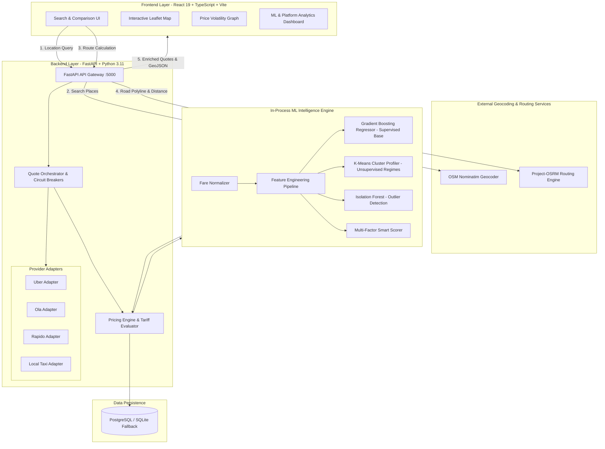

# RideCompare — Smart Taxi Fare Comparison & ML Price Intelligence Platform 🚖🧠

[](https://python.org)
[](https://fastapi.tiangolo.com)
[](https://react.dev)
[](https://typescriptlang.org)
[](https://vitejs.dev)
[](https://scikit-learn.org)
[]()
[](LICENSE)

**RideCompare** is an intelligent, real-time taxi and cab fare comparison platform designed to solve fragmented pricing, surge opacity, and commute planning across Indian metropolitan cities. 

It aggregates real-time quotes across **Uber**, **Ola**, **Rapido**, and **Local Taxis**, calculates optimal driving paths with turn-by-turn geometry via OpenStreetMap & Project-OSRM, and enriches every query with **in-process machine learning price intelligence**: theoretical fair tariff regression baselines, unsupervised pricing regime clustering, and surge anomaly detection.

---

## 📑 Table of Contents

1. [Key Features](#-key-features)
2. [System Architecture](#-system-architecture)
3. [Machine Learning Engine](#-machine-learning-engine)
4. [Supported Cities & Tariff Models](#-supported-cities--tariff-models)
5. [Tech Stack](#-tech-stack)
6. [Project Layout](#-project-layout)
7. [API Specification](#-api-specification)
8. [Quick Start & Installation](#-quick-start--installation)
9. [Testing & Verification](#-testing--verification)
10. [License](#-license)

---

## ⚡ Key Features

- **Multi-Provider Real-Time Aggregation:** Simultaneous quote evaluation across Uber (Go, Premier), Ola (Mini, Prime), Rapido (Bike, Auto), and Local Taxi meters within a 15-second freshness comparison window.
- **Itemized Tariff Breakdown:** Transparent fee visibility into base fares, distance charges, per-minute wait rates, platform commissions, and airport highway toll surcharges.
- **ML Expected Fare Baseline:** Supervised Gradient Boosting regressor ($R^2 = 0.9803$) estimates the fair mathematical baseline so users can see exact surge markups (`+₹Δ` and `%`).
- **Live Price Volatility Tracker:** Tracks historical price fluctuations and trends (`RISING`, `FALLING`, `STABLE`) per route corridor with interactive SVG sparkline graphs.
- **Unsupervised Pricing Regimes:** K-Means clustering ($K=3$, Silhouette $= 0.3323$) discovers transit archetypes (*Short City Commute*, *Suburban Corridor*, *Airport / Long Distance Express*).
- **Outlier & Anomaly Detection:** Isolation Forest flags abnormal surge spikes or tariff anomalies with human-readable diagnostic explanations.
- **Transparent Multi-Factor Smart Ranking:** Ranks rides based on a balanced formula incorporating price, ETA, prediction confidence, and brand reliability.
- **Direct App Deep Linking:** One-tap booking buttons that launch the provider app with pre-filled pickup and drop-off coordinates (fallback to web booking on desktop).
- **Interactive Routing Map:** Leaflet map visualizes exact road routing, distance markers, and straight-line fallback geometries.
- **Intelligence & Analytics Hub:** Comprehensive dashboard with 7-day search volume graphs, provider market share, and ML model retraining controls.
- **Progressive Web App (PWA):** Fully installable on iOS and Android devices for instant access from the home screen.

---

## 🏛 System Architecture



---

## 🧠 Machine Learning Engine

The ML subsystem operates in-process with sub-millisecond inference latency, integrating three distinct mathematical models trained on over 12,000 multi-provider trip records:

```
┌────────────────────────────────────────────────────────────────────────────────────────┐
│                               ML INTELLIGENCE PIPELINE                                 │
├──────────────────────────┬─────────────────────────────┬───────────────────────────────┤
│ Model                    │ Algorithm                   │ Key Metric / Configuration    │
├──────────────────────────┼─────────────────────────────┼───────────────────────────────┤
│ Expected Fare Prediction │ Gradient Boosting Regressor │ R² = 0.9803, MAE = ₹20.67     │
│ Pricing Regime Discovery │ K-Means Clustering          │ K = 3, Silhouette = 0.3323   │
│ Surge Anomaly Detection  │ Isolation Forest            │ Contamination = 3.0%          │
└──────────────────────────┴─────────────────────────────┴───────────────────────────────┘
```

### 1. Supervised Fare Regression (Gradient Boosting)
Estimates the theoretical fair tariff baseline for any arbitrary trip distance, duration, hour of day, and traffic density:
$$\text{Expected Fare} = f(\text{distance}, \text{duration}, \text{surge}, \text{traffic}, \sin(\text{hour}), \cos(\text{hour}), \text{weekend}, \text{cluster\_id})$$

*Evaluated against Random Forest on holdout validation data (80/20 split):*
- **Gradient Boosting (Selected):** $R^2 = 0.9803$, $\text{MAE} = ₹20.67$, $\text{RMSE} = ₹34.30$, $\text{MAPE} = 5.96\%$
- **Random Forest:** $R^2 = 0.9702$, $\text{MAE} = ₹23.51$, $\text{RMSE} = ₹42.21$, $\text{MAPE} = 6.41\%$

### 2. Unsupervised Regime Clustering (K-Means)
Groups trips into natural transit conditions without pre-labeled categories:
- **Cluster #0 (City Commute):** 1–7 km short urban trips, low volatility ($\bar{\text{fare}} = ₹120$).
- **Cluster #1 (Suburban Corridor):** 8–18 km arterial routes, rush-hour surge sensitive ($\bar{\text{fare}} = ₹380$).
- **Cluster #2 (Airport / Long Distance):** $>18$ km highway routes, toll and speed influenced ($\bar{\text{fare}} = ₹850$).

### 3. Multivariate Outlier Detection (Isolation Forest)
Identifies abnormal surge spikes and pricing anomalies using a 3% contamination threshold, returning boolean flags and human-readable diagnostic explanations.

### 4. Multi-Factor Smart Score
Ranks ride options transparently based on holistic passenger utility:
$$\text{Smart Score} = (0.40 \times \text{Price Score}) + (0.30 \times \text{ETA Score}) + (0.15 \times \text{Confidence}) + (0.15 \times \text{Reliability})$$

---

## 🏙 Supported Cities, Regional Mobility & Government Transit Bodies

RideCompare strictly enforces regional transit operational availability and integrates state government-backed / public mobility services:

| City / Hub | State / Region | Government / Public Mobility Services | Commercial App Policy | Regulatory Notice / Body |
| :--- | :--- | :--- | :--- | :--- |
| **Goa** | Goa | **GoaMiles** (Hatchback, Sedan), **GTDC Tourist Taxi** | ❌ **Prohibited** (Uber/Ola/Rapido do not operate in Goa) | Goa Tourism Development Corp (GTDC) & Transport Dept |
| **Kochi** | Kerala | **Kerala Savari** (Auto, Cab) — India's 1st State Govt Online Taxi | ✅ Operational (Uber, Ola, Rapido) | Govt of Kerala Labour Department (100% Zero Surge Guarantee) |
| **Kolkata** | West Bengal | **Yatri Sathi** (Meter Taxi), **Kolkata Yellow Taxi** | ✅ Operational (Uber, Ola, Rapido) | Govt of West Bengal IT & Electronics Dept / WB Transport Dept |
| **Mumbai** | Maharashtra | **Mumbai Kaali Peeli** (₹28 base), **Mumbai Cool Cab** (₹33 base) | ⚠️ Partial (Uber, Ola, Rapido Auto; **Bike Taxis restricted**) | Maharashtra RTO & Mumbai Taximen's Union |
| **Bangalore** | Karnataka | **Namma Yatri** (Open Mobility Auto), **KSTDC Airport Taxi** | ✅ Operational (Uber, Ola, Rapido) | ARDU / Open Mobility Network & KSTDC |
| **Delhi NCR** | Delhi NCR | **Delhi Metered Taxi** (AC/Non-AC), **Delhi Metered Auto** | ✅ Operational (Uber, Ola, Rapido) | Delhi Transport Dept (GNCTD) |
| **Chennai** | Tamil Nadu | **Fast Track Taxi**, **Chennai Metered Auto** | ✅ Operational (Uber, Ola, Rapido) | Tamil Nadu State Transport Dept & TN Tourist Taxi Assoc |
| **Hyderabad** | Telangana | **Hyderabad Prepaid Taxi**, **Hyderabad Metered Auto** | ✅ Operational (Uber, Ola, Rapido) | Telangana Road Transport Authority (RTA) & Passenger Safety |

---

## 🛠 Tech Stack

| Layer | Technologies |
| :--- | :--- |
| **Backend API** | Python 3.11, FastAPI, Uvicorn, SQLAlchemy, Pydantic v2, HTTPX |
| **Machine Learning** | Scikit-Learn, Pandas, NumPy, Joblib |
| **Database** | PostgreSQL with automated local SQLite fallback (`ridecompare.db`) |
| **Frontend UI** | React 19, TypeScript, Vite, Tailwind CSS, Lucide Icons |
| **Mapping & Geospatial** | Leaflet Maps, OpenStreetMap (Nominatim), Project-OSRM Routing |
| **DevOps & Testing** | Pytest, Docker, Docker Compose, PowerShell & Bash Local Runners |

---

## 📂 Project Layout

```text
RideCompare/
├── backend/
│   ├── app/
│   │   ├── config/
│   │   │   └── fares.json           # City tariff matrices & surge configurations
│   │   ├── models/
│   │   │   └── db_models.py         # Search, HistoricalFare, FareSnapshot & Analytics models
│   │   ├── routers/
│   │   │   ├── geocode.py           # Nominatim place autocompletion & LRU caching
│   │   │   ├── route.py             # Route calculation, OSRM proxy & fare aggregation
│   │   │   ├── analytics.py         # Aggregated platform telemetry & redirect click logging
│   │   │   └── ml_endpoints.py      # ML model inspection, single predictions & retraining
│   │   ├── services/
│   │   │   ├── adapters/
│   │   │   │   ├── base_adapter.py      # Base ProviderAdapter & QuoteObject dataclass
│   │   │   │   └── provider_adapters.py # Uber, Ola, Rapido & Local Taxi adapters
│   │   │   ├── quote_orchestrator.py    # Async parallel quote fetcher & volatility tracker
│   │   │   └── pricing.py               # Fare engine, surge detection & multi-factor scoring
│   │   ├── config.py                # Pydantic Settings & environment variables
│   │   ├── database.py              # Engine setup, session pooling & mock seed loader
│   │   └── main.py                  # FastAPI entrypoint, CORS & SPA static server
│   ├── tests/
│   │   ├── test_adapters.py         # Unit tests for provider adapters
│   │   ├── test_backend_api.py      # API endpoint tests & security headers
│   │   └── test_quote_orchestrator.py # Quote orchestration & hashing tests
│   ├── requirements.txt             # Python backend dependencies
│   └── Dockerfile                   # Production container definition
├── frontend/
│   ├── src/
│   │   ├── components/
│   │   │   ├── AnalyticsDashboard.tsx # Usage trends & ML performance hub
│   │   │   ├── MapView.tsx            # Leaflet map with route polyline
│   │   │   ├── Navbar.tsx             # Theme toggle & view switcher
│   │   │   ├── PriceHistoryGraph.tsx  # SVG sparkline of price volatility
│   │   │   ├── RideComparison.tsx     # Provider comparison cards & deep links
│   │   │   └── SearchPanel.tsx        # Geocoding autocomplete inputs
│   │   ├── types/
│   │   │   └── ride.ts                # TypeScript domain interfaces
│   │   ├── utils/
│   │   │   └── api.ts                 # Fetch wrapper with relative routing
│   │   ├── App.tsx                    # Main state manager & PWA banner
│   │   ├── main.tsx                   # React root mount
│   │   └── index.css                  # Tailwind styles
│   ├── package.json
│   ├── tsconfig.json
│   └── vite.config.ts
├── ml/
│   ├── data/                        # Historical training datasets
│   ├── evaluation/                  # Holdout validation scripts
│   ├── inference/
│   │   ├── normalizer.py            # Feature engineering & tariff normalization
│   │   └── predictor.py             # Production FareIntelligenceEngine
│   ├── models/saved/                # Serialized Joblib models & metadata
│   ├── training/
│   │   ├── train_pipeline.py        # Supervised & unsupervised training orchestration
│   │   └── anomaly_detection.py     # Isolation Forest training logic
│   └── tests/
│       └── test_ml_pipeline.py      # ML unit & edge-case test suite
├── docker-compose.yml               # Multi-container orchestration
├── run-local.ps1                    # 1-Click Windows PowerShell launcher
├── run-local.bat                    # 1-Click Windows Batch launcher
├── run-local.sh                     # 1-Click Linux / macOS launcher
├── server.py                        # Standalone Python backend launcher
└── README.md                        # Documentation
```

---

## 📡 API Specification

Interactive Swagger UI documentation is available at `http://127.0.0.1:5000/docs` and ReDoc at `http://127.0.0.1:5000/redoc`.

| Method | Endpoint | Description |
| :--- | :--- | :--- |
| `GET` | `/health` | System health check, database status & ML engine readiness |
| `GET` | `/api/geocode?q={query}` | Autocomplete place suggestions from Nominatim |
| `GET` | `/api/route?start={lon,lat}&end={lon,lat}` | OSRM road route geometry & multi-provider fare comparison |
| `POST` | `/api/route` | JSON payload route comparison with custom place labels |
| `POST` | `/api/fare/compare` | Direct fare comparison with distance & duration overrides |
| `POST` | `/api/fare/predict` | Supervised ML expected fare regression & anomaly estimation |
| `GET` | `/api/fare/history` | Historical quote ledger for analytics |
| `POST` | `/api/redirect` | Records booking conversion clicks and returns provider URLs |
| `GET` | `/api/analytics` | 7-day search volume, savings averages, and provider market share |
| `GET` | `/api/ml/clusters` | Unsupervised K-Means pricing regime profiles |
| `GET` | `/api/ml/model-performance` | Model validation metrics ($R^2$, MAE, RMSE, MAPE, Silhouette) |
| `POST` | `/api/ml/retrain` | Triggers asynchronous model retraining pipeline |

---

## 🚀 Quick Start & Installation

### Option 1: Automated 1-Click Launchers (Recommended)

From the root of the repository, run the runner for your environment:

- **Windows PowerShell:**
  ```powershell
  .\run-local.ps1
  ```
- **Windows Command Prompt:**
  ```cmd
  run-local.bat
  ```
- **Linux / macOS:**
  ```bash
  chmod +x run-local.sh
  ./run-local.sh
  ```

### Option 2: Manual Step-by-Step

**1. Clone the repository:**
```bash
git clone https://github.com/your-username/RideCompare.git
cd RideCompare
```

**2. Backend Setup:**
```bash
# Install Python dependencies
python -m pip install -r requirements.txt

# Start the FastAPI backend
python server.py
# Backend runs at http://127.0.0.1:5000
```

**3. Frontend Setup:**
```bash
cd frontend
npm install
npm run dev
# Frontend runs at http://localhost:5173
```

### Option 3: Docker Compose

```bash
docker compose up --build
```
- Frontend: `http://localhost:8080`
- Backend: `http://localhost:5000`
- Database: `localhost:5432`

---

## 🧪 Testing & Verification

Run the full automated test suite covering all endpoints, database fallbacks, ML pipelines, and frontend builds:

```bash
# 1. Run all 24 Python backend and ML unit tests
python -m pytest -v

# 2. Run ML-specific validation tests
python -m pytest ml/tests/ -v

# 3. Verify frontend TypeScript types and production build
cd frontend
npm run build
```

---

## 📄 License

This project is licensed under the **MIT License** — free for personal, educational, and commercial use.
